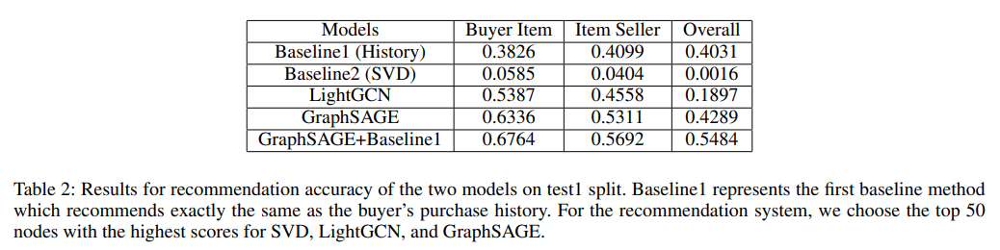

# GNNs for c2c recommendation system
#### CS 4352 Final Project
##### Xinyu Gao, Xinxuan Lu
This repository contains the code for the final project of CS 4352 done by Xinyu Gao and Xinxuan Lu.

## Requirements
This repository is built on 
pyg-2.1.0,
pytorch-1.12.0, cuda-11.3, and torchvision-0.13.0.
LightGCN: built on pytorch-1.13.0, cuda-11.6 (colab)

## Folder structure
```
${ROOT}
└── checkpoint/    
    └── placeholder
└── data/    
    └── split/
        ├── buyer_item.txt
        ├── buyer_item_test.txt
        ├── buyer_item_train.txt
        ├── buyer_item_val.txt
        ├── buyer_test.txt
        ├── buyer_train.txt
        ├── buyer_val.txt
        ├── item_seller.txt
        ├── item_seller_test.txt
        ├── item_seller_train.txt
        ├── item_seller_val.txt
    └── split2/
        ├── buyer_item.txt
        ├── buyer_item_test.txt
        ├── buyer_item_train.txt
        ├── buyer_item_val.txt
        ├── buyer_test.txt
        ├── buyer_train.txt
        ├── buyer_val.txt
        ├── item_seller.txt
        ├── item_seller_test.txt
        ├── item_seller_train.txt
        └── item_seller_val.txt
└── lightGCN/
    └── convert_to_data.py
    ├── LightGCN.ipynb
    ├── buyer_item.pt
    ├── item_seller.pt
└── GraphSAGE/
    ├── baseline.py
    ├── graphsage.py
    ├── svd.py
    ├── test.py
    ├── test_with_baseline.py
    ├── train_buyer_item.py
    ├── train_item_seller.py
    └── utils.py
├── README.md 
└── preprocess.ipynb
```

## Data Preprocess
The file preprocess.ipynb contains the codes to preprocess the original bonanza transaction data into the
buyer-item graph and the item-seller graph.
You can change the split ratio and store path in preprocess.ipynb.

## GraphSAGE
In GraphSAGE folder, graphsage.py contains the source code of the models.
train_buyer_item.py and train_item_seller.py are used to train the two separate models.
test.py and test_with_baseline.py are used to test the performance of the models after they are trained.
test_with_baseline test the performance of the GraphSAGE by adding the purchase history of users.
svd.py test the performance of SVD on adjacency matrix.
baseline.py test the performance of recommend based solely on the purchase history of the users.

To change between split1 (split) and split2, please change the code at the top of each file.

All the checkpoint files created during training are stored in checkpoint/ folder.
The test files use these checkpoint files. Make sure you run the two training files before running test files.

## LightGCN
convert_to_data.py: the inputs of convert_to_data.py are buyer_item.txt and item_seller.txt (within data foloder) and
the outputs are buyer_item.pt and item_seller.pt (within LightGCN folder). The purpose of this file is to convert information 
from text format to graph format. 

LightGCN.ipynb: the inputs of LightGCN.ipynb are buyer_item.txt, item_seller.txt, buyer_item.pt, and item_seller.pt. There are
five major steps in this file. 1. Develop the LightGCN model 2. Load Data 3. Train buyer_item and item_seller models 4. Calculate metrics
5. Draw bipartite graphs


## Results

The table shows the recommendation accuracy of the two models by choosing the top 50 items and sellers.
